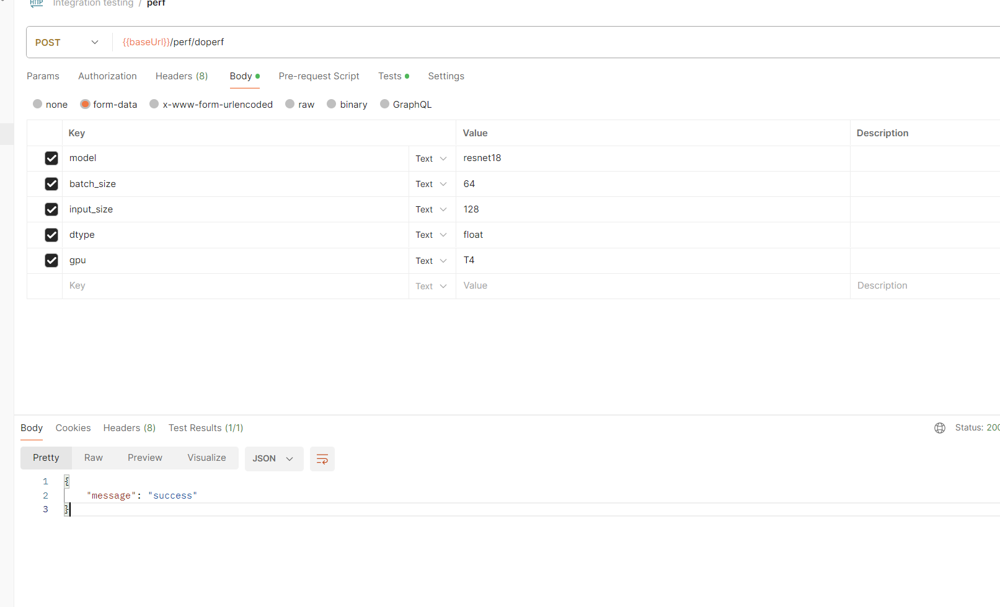
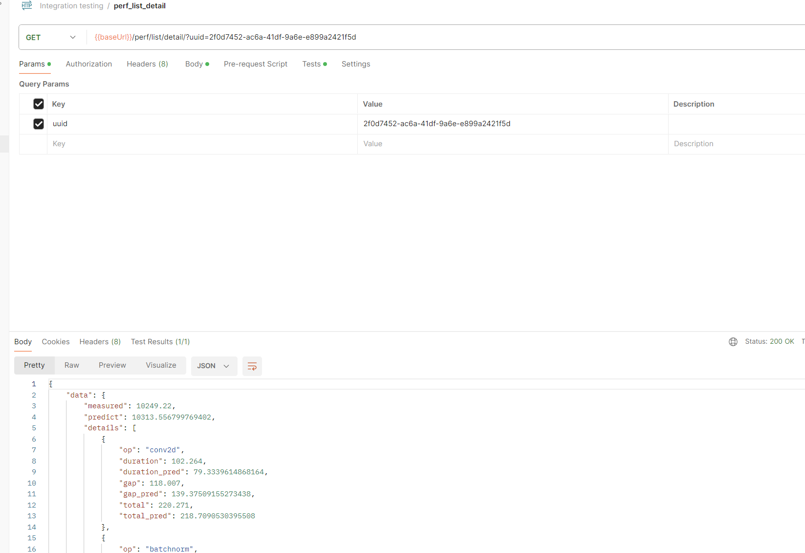
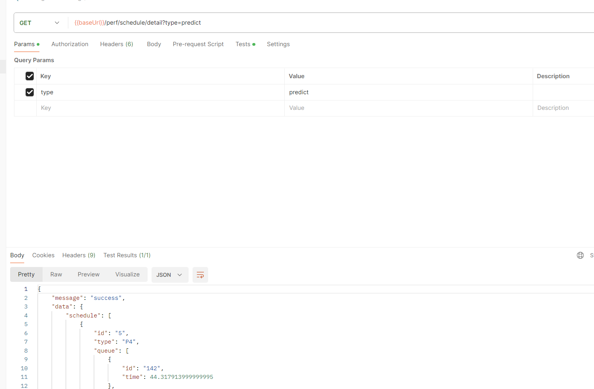

### 地址
**ip : 47.120.43.213
端口：8000**

### 任务提交页面
#### 接口定义
```
# Post方法
ip:port/perf/doperf
```

#### 参数


1. model（模型）可勾选：Resnet50, Alexnet, GoogleNet, LSTM, densenet, 按照字母排序
2. batch_size（批处理大小）可勾选：8， 16， 32， 64， 128， 256
3. input_size（输入大小）可勾选：28， 32， 64， 128， 256， 378
4. dtype（数据类型）可勾选：Half, Float, Double
5. gpu(GPU)可勾选：T4, P4, 1080Ti, 2080Ti, 3080Ti


#### 返回举例
```
{
    "message": "success"
}
```


### 任务列举页面

#### 接口定义
```
# Get方法
ip:port/perf/list/all
```

#### 参数（无）


#### 返回结果示例
```
{
    "data": [
        {
            "model": "squeezenet1_0",
            "batch_size": 64,
            "input_size": 512,
            "dtype": 1,
            "gpu": "T4CPUALL",
            "log_id": "ee22c7f5-caa0-4add-b7c6-f4a6242c7bfb",
            "time": "2024-01-16 09:07:43",
            "error": "",
            "status": "Perfed"
        },
        {
            "model": "resnet18",
            "batch_size": 32,
            "input_size": 384,
            "dtype": 1,
            "gpu": "T4CPUALL",
            "log_id": "33c057f4-6be2-49ea-a060-c461ff23ee9a",
            "time": "2024-01-16 09:07:43",
            "error": "",
            "status": "Perfed"
        },
        {
            "model": "efficientnet_b1",
            "batch_size": 32,
            "input_size": 160,
            "dtype": 1,
            "gpu": "T4CPUALL",
            "log_id": "c8ed98f5-4149-4790-a253-ffbb2c60ebab",
            "time": "2024-01-16 09:07:43",
            "error": "",
            "status": "Perfed"
        },
        {
            "model": "densenet121",
            "batch_size": 8,
            "input_size": 64,
            "dtype": 1,
            "gpu": "T4CPUALL",
            "log_id": "2f0d7452-ac6a-41df-9a6e-e899a2421f5d",
            "time": "2024-01-16 09:07:43",
            "error": "",
            "status": "Perfed"
        },
        {
            "model": "resnet18",
            "batch_size": 256,
            "input_size": 128,
            "dtype": 1,
            "gpu": "T4CPUALL",
            "log_id": "a0cc6d4d-855b-4afd-9820-0d6e85154059",
            "time": "2024-01-16 09:07:43",
            "error": "",
            "status": "Perfed"
        }
    ]
}
```


### 任务细节界面

#### 接口定义
```
# Get方法
ip:port/perf/list/detail
```

#### 参数


1. uuid：即list_all返回结果里面每一项的log_id


#### 返回

```
{
    "data": {
        "measured": 10249.22,
        "predict": 10313.556799769402,
        "details": [
            {
                "op": "conv2d",
                "duration": 102.264,
                "duration_pred": 79.3339614868164,
                "gap": 118.007,
                "gap_pred": 139.37509155273438,
                "total": 220.271,
                "total_pred": 218.7090530395508
            },
            {
                "op": "batchnorm",
                "duration": 30.398,
                "duration_pred": 16.00364112854004,
                "gap": 513.242,
                "gap_pred": 547.45654296875,
                "total": 543.64,
                "total_pred": 563.46018409729
            },
            {
                "op": "relu",
                "duration": 11.487,
                "duration_pred": 6.519815921783447,
                "gap": 237.326,
                "gap_pred": 261.9364929199219,
                "total": 248.813,
                "total_pred": 268.4563088417053
            },
            {
                "op": "max_pool2d",
                "duration": 29.438,
                "duration_pred": 20.180566787719727,
                "gap": 317.608,
                "gap_pred": 351.62217712402344,
                "total": 347.046,
                "total_pred": 371.8027439117432
            },
            {
                "op": "batchnorm",
                "duration": 18.559,
                "duration_pred": 25.231225967407227,
                "gap": 559.446,
                "gap_pred": 588.5527954101562,
                "total": 578.005,
                "total_pred": 613.7840213775635
            },
            {
                "op": "relu",
                "duration": 5.664,
                "duration_pred": 5.707239627838135,
                "gap": 255.629,
                "gap_pred": 255.73748016357425,
                "total": 261.293,
                "total_pred": 261.44471979141235
            },
            {
                "op": "conv2d",
                "duration": 40.605,
                "duration_pred": 41.11191940307617,
                "gap": 329.095,
                "gap_pred": 179.2867228190104,
                "total": 369.7000000000001,
                "total_pred": 220.39864222208655
            },
            {
                "op": "batchnorm",
                "duration": 26.654,
                "duration_pred": 26.997212092081707,
                "gap": 549.432,
                "gap_pred": 570.4864705403646,
                "total": 576.086,
                "total_pred": 597.4836826324463
            },
            {
                "op": "relu",
                "duration": 7.807,
                "duration_pred": 8.398803075154623,
                "gap": 257.261,
                "gap_pred": 249.59194946289065,
                "total": 265.06800000000004,
                "total_pred": 257.99075253804523
            },
            {
                "op": "conv2d",
                "duration": 89.401,
                "duration_pred": 88.37290954589844,
                "gap": 95.033,
                "gap_pred": 84.35778999328613,
                "total": 184.434,
                "total_pred": 172.73069953918457
            },
            {
                "op": "cat",
                "duration": 13.855,
                "duration_pred": 15.687265396118164,
                "gap": 163.508,
                "gap_pred": 170.46926879882812,
                "total": 177.363,
                "total_pred": 186.1565341949463
            },
            {
                "op": "batchnorm",
                "duration": 24.286,
                "duration_pred": 26.35448694229126,
                "gap": 551.255,
                "gap_pred": 584.982177734375,
                "total": 575.5409999999999,
                "total_pred": 611.3366646766663
            },
            {
                "op": "relu",
                "duration": 6.911,
                "duration_pred": 6.524736881256104,
                "gap": 245.678,
                "gap_pred": 247.8998031616211,
                "total": 252.589,
                "total_pred": 254.4245400428772
            },
            {
                "op": "conv2d",
                "duration": 49.788,
                "duration_pred": 45.0711669921875,
                "gap": 167.284,
                "gap_pred": 170.7599639892578,
                "total": 217.072,
                "total_pred": 215.8311309814453
            },
            {
                "op": "batchnorm",
                "duration": 26.493,
                "duration_pred": 28.049936771392822,
                "gap": 543.064,
                "gap_pred": 570.6038513183594,
                "total": 569.557,
                "total_pred": 598.6537880897522
            },
            {
                "op": "relu",
                "duration": 7.68,
                "duration_pred": 8.179529428482056,
                "gap": 238.446,
                "gap_pred": 249.08894729614255,
                "total": 246.126,
                "total_pred": 257.26847672462463
            },
            {
                "op": "conv2d",
                "duration": 88.921,
                "duration_pred": 94.3972053527832,
                "gap": 96.345,
                "gap_pred": 101.96925735473631,
                "total": 185.266,
                "total_pred": 196.36646270751956
            },
            {
                "op": "cat",
                "duration": 17.407,
                "duration_pred": 19.408586502075195,
                "gap": 160.564,
                "gap_pred": 165.91049194335938,
                "total": 177.971,
                "total_pred": 185.31907844543457
            },
            {
                "op": "batchnorm",
                "duration": 26.749,
                "duration_pred": 25.242151260375977,
                "gap": 552.536,
                "gap_pred": 589.5777893066406,
                "total": 579.285,
                "total_pred": 614.8199405670166
            },
            {
                "op": "relu",
                "duration": 7.647,
                "duration_pred": 8.052919626235962,
                "gap": 245.134,
                "gap_pred": 253.33396530151367,
                "total": 252.781,
                "total_pred": 261.38688492774963
            },
            {
                "op": "conv2d",
                "duration": 58.267,
                "duration_pred": 61.95542812347412,
                "gap": 165.012,
                "gap_pred": 153.40119552612305,
                "total": 223.279,
                "total_pred": 215.3566236495972
            },
            {
                "op": "batchnorm",
                "duration": 26.751,
                "duration_pred": 25.58138465881348,
                "gap": 548.438,
                "gap_pred": 566.5951232910156,
                "total": 575.189,
                "total_pred": 592.1765079498291
            },
            {
                "op": "relu",
                "duration": 7.968,
                "duration_pred": 8.163820385932922,
                "gap": 235.662,
                "gap_pred": 252.34090042114255,
                "total": 243.63,
                "total_pred": 260.5047208070755
            },
            {
                "op": "conv2d",
                "duration": 89.274,
                "duration_pred": 81.1547966003418,
                "gap": 99.576,
                "gap_pred": 99.37999725341795,
                "total": 188.85,
                "total_pred": 180.53479385375977
            },
            {
                "op": "cat",
                "duration": 20.383,
                "duration_pred": 20.86934900283813,
                "gap": 159.316,
                "gap_pred": 172.4268341064453,
                "total": 179.699,
                "total_pred": 193.29618310928345
            },
            {
                "op": "batchnorm",
                "duration": 27.581,
                "duration_pred": 28.687052249908447,
                "gap": 700.492,
                "gap_pred": 583.2426452636719,
                "total": 728.073,
                "total_pred": 611.9296975135803
            },
            {
                "op": "relu",
                "duration": 8.832,
                "duration_pred": 7.661325812339783,
                "gap": 243.95,
                "gap_pred": 247.25950241088867,
                "total": 252.782,
                "total_pred": 254.92082822322843
            },
            {
                "op": "conv2d",
                "duration": 66.426,
                "duration_pred": 66.56759738922119,
                "gap": 156.277,
                "gap_pred": 149.90907669067383,
                "total": 222.703,
                "total_pred": 216.47667407989505
            },
            {
                "op": "batchnorm",
                "duration": 27.005,
                "duration_pred": 23.45631599426269,
                "gap": 537.433,
                "gap_pred": 578.6115570068359,
                "total": 564.438,
                "total_pred": 602.0678730010986
            },
            {
                "op": "relu",
                "duration": 7.839,
                "duration_pred": 7.538591742515564,
                "gap": 234.831,
                "gap_pred": 250.9299964904785,
                "total": 242.67,
                "total_pred": 258.4685882329941
            }
        ]
    }
}
```


### 任务调度界面

#### 接口定义
```
# Get方法
ip:port/perf/schedule
```

#### 参数


1. type: 可勾选， predict或者random

#### 返回实例
1. schedule里面是一个数组类型。每个数组表示柱状图的一行， 其中type为柱状图的坐标轴名称。queue表示这个柱状图中的元素，顺序按照time放置每一个queue中的元素

```
{
    "message": "success",
    "data": {
        "schedule": [
            {
                "id": "5",
                "type": "P4",
                "queue": [
                    {
                        "id": "142",
                        "time": 44.317913999999995
                    },
                    {
                        "id": "173",
                        "time": 45.300314999999976
                    },
                    {
                        "id": "65",
                        "time": 46.869965
                    },
                    {
                        "id": "4",
                        "time": 82.958005
                    },
                    {
                        "id": "236",
                        "time": 151.1444689999999
                    },
                    {
                        "id": "127",
                        "time": 152.23565399999978
                    },
                    {
                        "id": "218",
                        "time": 154.02124400000008
                    },
                    {
                        "id": "152",
                        "time": 154.85050299999986
                    },
                    {
                        "id": "183",
                        "time": 157.17192499999993
                    },
                    {
                        "id": "50",
                        "time": 462.41919399999995
                    }
                ]
            },
            {
                "id": "6",
                "type": "P4",
                "queue": [
                    {
                        "id": "42",
                        "time": 44.81412200000001
                    },
                    {
                        "id": "188",
                        "time": 46.13385899999999
                    },
                    {
                        "id": "110",
                        "time": 46.869965
                    },
                    {
                        "id": "200",
                        "time": 82.958005
                    },
                    {
                        "id": "276",
                        "time": 151.26050799999987
                    },
                    {
                        "id": "215",
                        "time": 152.23565399999978
                    },
                    {
                        "id": "292",
                        "time": 154.02124400000008
                    },
                    {
                        "id": "249",
                        "time": 154.85050299999986
                    },
                    {
                        "id": "63",
                        "time": 177.79410099999996
                    },
                    {
                        "id": "115",
                        "time": 462.41919399999995
                    }
                ]
            },
            {
                "id": "7",
                "type": "P4",
                "queue": [
                    {
                        "id": "257",
                        "time": 44.81412200000001
                    },
                    {
                        "id": "0",
                        "time": 46.15909700000001
                    },
                    {
                        "id": "174",
                        "time": 46.869965
                    },
                    {
                        "id": "15",
                        "time": 139.175988
                    },
                    {
                        "id": "81",
                        "time": 151.3951040000001
                    },
                    {
                        "id": "17",
                        "time": 152.6723309999999
                    },
                    {
                        "id": "297",
                        "time": 154.02124400000008
                    },
                    {
                        "id": "153",
                        "time": 156.9607110000002
                    },
                    {
                        "id": "151",
                        "time": 300.4007550000001
                    },
                    {
                        "id": "35",
                        "time": 706.4292349999997
                    }
                ]
            },
            {
                "id": "8",
                "type": "P4",
                "queue": [
                    {
                        "id": "33",
                        "time": 44.888068000000004
                    },
                    {
                        "id": "278",
                        "time": 46.45897299999997
                    },
                    {
                        "id": "12",
                        "time": 49.31970400000002
                    },
                    {
                        "id": "245",
                        "time": 139.175988
                    },
                    {
                        "id": "201",
                        "time": 151.75863999999999
                    },
                    {
                        "id": "213",
                        "time": 153.900667
                    },
                    {
                        "id": "293",
                        "time": 154.050917
                    },
                    {
                        "id": "156",
                        "time": 156.9607110000002
                    },
                    {
                        "id": "109",
                        "time": 445.23413100000005
                    }
                ]
            },
            {
                "id": "9",
                "type": "P4",
                "queue": [
                    {
                        "id": "250",
                        "time": 44.951794
                    },
                    {
                        "id": "30",
                        "time": 46.64389200000001
                    },
                    {
                        "id": "264",
                        "time": 60.789312
                    },
                    {
                        "id": "272",
                        "time": 150.509964
                    },
                    {
                        "id": "196",
                        "time": 151.77336400000013
                    },
                    {
                        "id": "283",
                        "time": 154.01418899999976
                    },
                    {
                        "id": "176",
                        "time": 154.184049
                    },
                    {
                        "id": "73",
                        "time": 157.17192499999993
                    },
                    {
                        "id": "60",
                        "time": 449.74511
                    }
                ]
            },
            {
                "id": "10",
                "type": "2080Ti",
                "queue": [
                    {
                        "id": "228",
                        "time": 11.345420999999998
                    },
                    {
                        "id": "160",
                        "time": 15.282160999999997
                    },
                    {
                        "id": "265",
                        "time": 18.628508999999994
                    },
                    {
                        "id": "275",
                        "time": 20.481199
                    },
                    {
                        "id": "129",
                        "time": 23.70312000000001
                    },
                    {
                        "id": "252",
                        "time": 25.13542999999999
                    },
                    {
                        "id": "253",
                        "time": 29.321038999999992
                    },
                    {
                        "id": "55",
                        "time": 34.778102999999994
                    },
                    {
                        "id": "105",
                        "time": 35.831725000000006
                    },
                    {
                        "id": "186",
                        "time": 41.280115
                    },
                    {
                        "id": "116",
                        "time": 48.943200999999995
                    },
                    {
                        "id": "254",
                        "time": 65.64038099999998
                    },
                    {
                        "id": "140",
                        "time": 78.99530099999991
                    },
                    {
                        "id": "243",
                        "time": 81.423468
                    },
                    {
                        "id": "118",
                        "time": 82.64109400000004
                    },
                    {
                        "id": "159",
                        "time": 82.92615500000002
                    },
                    {
                        "id": "285",
                        "time": 83.26358300000005
                    },
                    {
                        "id": "19",
                        "time": 83.91273700000004
                    },
                    {
                        "id": "226",
                        "time": 83.91273700000004
                    },
                    {
                        "id": "78",
                        "time": 87.51340000000002
                    },
                    {
                        "id": "23",
                        "time": 95.70033199999999
                    },
                    {
                        "id": "89",
                        "time": 121.08196700000008
                    },
                    {
                        "id": "207",
                        "time": 129.20588199999997
                    },
                    {
                        "id": "134",
                        "time": 142.623403
                    },
                    {
                        "id": "21",
                        "time": 166.15189100000003
                    },
                    {
                        "id": "158",
                        "time": 216.46345499999998
                    }
                ]
            },
            {
                "id": "11",
                "type": "2080Ti",
                "queue": [
                    {
                        "id": "246",
                        "time": 11.345420999999998
                    },
                    {
                        "id": "202",
                        "time": 17.050926999999994
                    },
                    {
                        "id": "39",
                        "time": 18.8745
                    },
                    {
                        "id": "247",
                        "time": 20.662514000000005
                    },
                    {
                        "id": "83",
                        "time": 23.942667000000007
                    },
                    {
                        "id": "67",
                        "time": 25.43977900000001
                    },
                    {
                        "id": "69",
                        "time": 30.03866900000001
                    },
                    {
                        "id": "93",
                        "time": 34.778102999999994
                    },
                    {
                        "id": "135",
                        "time": 37.036032999999996
                    },
                    {
                        "id": "123",
                        "time": 41.62922600000002
                    },
                    {
                        "id": "296",
                        "time": 48.943200999999995
                    },
                    {
                        "id": "8",
                        "time": 68.237122
                    },
                    {
                        "id": "211",
                        "time": 78.99530099999991
                    },
                    {
                        "id": "1",
                        "time": 82.15043400000003
                    },
                    {
                        "id": "261",
                        "time": 82.64109400000004
                    },
                    {
                        "id": "6",
                        "time": 83.10059499999997
                    },
                    {
                        "id": "208",
                        "time": 83.37452900000002
                    },
                    {
                        "id": "99",
                        "time": 83.91273700000004
                    },
                    {
                        "id": "80",
                        "time": 84.03472400000007
                    },
                    {
                        "id": "85",
                        "time": 89.19174100000008
                    },
                    {
                        "id": "172",
                        "time": 95.70033199999999
                    },
                    {
                        "id": "244",
                        "time": 121.08196700000008
                    },
                    {
                        "id": "40",
                        "time": 132.25976500000004
                    },
                    {
                        "id": "240",
                        "time": 144.72388899999999
                    },
                    {
                        "id": "268",
                        "time": 166.15189100000003
                    },
                    {
                        "id": "170",
                        "time": 216.46345499999998
                    }
                ]
            },
            {
                "id": "12",
                "type": "2080Ti",
                "queue": [
                    {
                        "id": "286",
                        "time": 11.748325999999999
                    },
                    {
                        "id": "198",
                        "time": 17.635702000000002
                    },
                    {
                        "id": "171",
                        "time": 19.689384
                    },
                    {
                        "id": "102",
                        "time": 21.250037000000003
                    },
                    {
                        "id": "163",
                        "time": 23.990706000000007
                    },
                    {
                        "id": "87",
                        "time": 29.137044000000003
                    },
                    {
                        "id": "242",
                        "time": 30.03866900000001
                    },
                    {
                        "id": "224",
                        "time": 35.104390999999985
                    },
                    {
                        "id": "281",
                        "time": 37.036032999999996
                    },
                    {
                        "id": "239",
                        "time": 47.336447
                    },
                    {
                        "id": "38",
                        "time": 51.748668
                    },
                    {
                        "id": "108",
                        "time": 71.687596
                    },
                    {
                        "id": "279",
                        "time": 78.99530099999991
                    },
                    {
                        "id": "68",
                        "time": 82.50587000000007
                    },
                    {
                        "id": "177",
                        "time": 82.71924299999993
                    },
                    {
                        "id": "14",
                        "time": 83.10059499999997
                    },
                    {
                        "id": "29",
                        "time": 83.64185099999995
                    },
                    {
                        "id": "139",
                        "time": 83.91273700000004
                    },
                    {
                        "id": "182",
                        "time": 84.59803700000006
                    },
                    {
                        "id": "66",
                        "time": 89.21108500000004
                    },
                    {
                        "id": "238",
                        "time": 102.54159299999989
                    },
                    {
                        "id": "3",
                        "time": 126.16546300000003
                    },
                    {
                        "id": "90",
                        "time": 132.25976500000004
                    },
                    {
                        "id": "137",
                        "time": 147.57350900000003
                    },
                    {
                        "id": "232",
                        "time": 172.453039
                    },
                    {
                        "id": "54",
                        "time": 222.116385
                    }
                ]
            },
            {
                "id": "13",
                "type": "2080Ti",
                "queue": [
                    {
                        "id": "107",
                        "time": 12.069998999999994
                    },
                    {
                        "id": "74",
                        "time": 18.628508999999994
                    },
                    {
                        "id": "227",
                        "time": 19.689384
                    },
                    {
                        "id": "61",
                        "time": 23.298050999999997
                    },
                    {
                        "id": "132",
                        "time": 24.285056000000004
                    },
                    {
                        "id": "251",
                        "time": 29.137044000000003
                    },
                    {
                        "id": "101",
                        "time": 30.318791000000004
                    },
                    {
                        "id": "167",
                        "time": 35.384340999999985
                    },
                    {
                        "id": "263",
                        "time": 40.850956000000004
                    },
                    {
                        "id": "79",
                        "time": 48.418134999999985
                    },
                    {
                        "id": "150",
                        "time": 51.748668
                    },
                    {
                        "id": "25",
                        "time": 77.268039
                    },
                    {
                        "id": "7",
                        "time": 81.24938499999998
                    },
                    {
                        "id": "197",
                        "time": 82.50587000000007
                    },
                    {
                        "id": "20",
                        "time": 82.85543199999998
                    },
                    {
                        "id": "130",
                        "time": 83.10059499999997
                    },
                    {
                        "id": "191",
                        "time": 83.751247
                    },
                    {
                        "id": "168",
                        "time": 83.91273700000004
                    },
                    {
                        "id": "290",
                        "time": 84.59803700000006
                    },
                    {
                        "id": "37",
                        "time": 90.78624600000008
                    },
                    {
                        "id": "56",
                        "time": 102.99219800000002
                    },
                    {
                        "id": "100",
                        "time": 129.20588199999997
                    },
                    {
                        "id": "204",
                        "time": 132.25976500000004
                    },
                    {
                        "id": "24",
                        "time": 155.344164
                    },
                    {
                        "id": "214",
                        "time": 182.77894599999996
                    },
                    {
                        "id": "266",
                        "time": 222.116385
                    }
                ]
            },
            {
                "id": "14",
                "type": "2080Ti",
                "queue": [
                    {
                        "id": "161",
                        "time": 12.255894999999999
                    },
                    {
                        "id": "155",
                        "time": 18.628508999999994
                    },
                    {
                        "id": "117",
                        "time": 19.769429
                    },
                    {
                        "id": "282",
                        "time": 23.298050999999997
                    },
                    {
                        "id": "92",
                        "time": 25.13542999999999
                    },
                    {
                        "id": "175",
                        "time": 29.321038999999992
                    },
                    {
                        "id": "10",
                        "time": 33.751716999999985
                    },
                    {
                        "id": "43",
                        "time": 35.831725000000006
                    },
                    {
                        "id": "57",
                        "time": 41.280115
                    },
                    {
                        "id": "141",
                        "time": 48.418134999999985
                    },
                    {
                        "id": "13",
                        "time": 65.64038099999998
                    },
                    {
                        "id": "91",
                        "time": 77.268039
                    },
                    {
                        "id": "299",
                        "time": 81.24938499999998
                    },
                    {
                        "id": "144",
                        "time": 82.52277500000007
                    },
                    {
                        "id": "120",
                        "time": 82.85543199999998
                    },
                    {
                        "id": "26",
                        "time": 83.23921899999998
                    },
                    {
                        "id": "143",
                        "time": 83.89656599999996
                    },
                    {
                        "id": "185",
                        "time": 83.91273700000004
                    },
                    {
                        "id": "187",
                        "time": 86.13331599999995
                    },
                    {
                        "id": "234",
                        "time": 92.65026899999998
                    },
                    {
                        "id": "128",
                        "time": 112.56429900000002
                    },
                    {
                        "id": "189",
                        "time": 129.20588199999997
                    },
                    {
                        "id": "256",
                        "time": 138.928244
                    },
                    {
                        "id": "258",
                        "time": 155.344164
                    },
                    {
                        "id": "103",
                        "time": 211.93986900000002
                    },
                    {
                        "id": "122",
                        "time": 250.54755
                    }
                ]
            },
            {
                "id": "15",
                "type": "3080Ti",
                "queue": [
                    {
                        "id": "112",
                        "time": 7.809926000000002
                    },
                    {
                        "id": "270",
                        "time": 16.945804
                    },
                    {
                        "id": "222",
                        "time": 22.968505
                    },
                    {
                        "id": "269",
                        "time": 26.401447000000008
                    },
                    {
                        "id": "84",
                        "time": 29.79060700000001
                    },
                    {
                        "id": "45",
                        "time": 31.499705000000002
                    },
                    {
                        "id": "166",
                        "time": 35.45649099999999
                    },
                    {
                        "id": "289",
                        "time": 42.09539700000001
                    },
                    {
                        "id": "154",
                        "time": 45.53949100000001
                    },
                    {
                        "id": "298",
                        "time": 52.87157400000001
                    },
                    {
                        "id": "280",
                        "time": 62.16969200000003
                    },
                    {
                        "id": "31",
                        "time": 72.59589700000001
                    },
                    {
                        "id": "114",
                        "time": 82.03891300000004
                    },
                    {
                        "id": "113",
                        "time": 89.67977599999996
                    },
                    {
                        "id": "72",
                        "time": 94.36903199999999
                    },
                    {
                        "id": "162",
                        "time": 96.02754900000001
                    },
                    {
                        "id": "235",
                        "time": 97.75381199999994
                    },
                    {
                        "id": "180",
                        "time": 99.50185200000006
                    },
                    {
                        "id": "210",
                        "time": 102.472992
                    },
                    {
                        "id": "184",
                        "time": 112.84368800000001
                    },
                    {
                        "id": "157",
                        "time": 120.025373
                    },
                    {
                        "id": "295",
                        "time": 135.106392
                    },
                    {
                        "id": "96",
                        "time": 148.97762699999987
                    },
                    {
                        "id": "255",
                        "time": 178.117589
                    },
                    {
                        "id": "32",
                        "time": 292.2915410000001
                    }
                ]
            },
            {
                "id": "16",
                "type": "3080Ti",
                "queue": [
                    {
                        "id": "179",
                        "time": 7.809926000000002
                    },
                    {
                        "id": "267",
                        "time": 17.712646
                    },
                    {
                        "id": "271",
                        "time": 23.848606999999998
                    },
                    {
                        "id": "149",
                        "time": 27.596772000000005
                    },
                    {
                        "id": "206",
                        "time": 29.79060700000001
                    },
                    {
                        "id": "71",
                        "time": 32.097837
                    },
                    {
                        "id": "44",
                        "time": 37.879513
                    },
                    {
                        "id": "121",
                        "time": 43.330507999999995
                    },
                    {
                        "id": "147",
                        "time": 47.039247
                    },
                    {
                        "id": "111",
                        "time": 59.926750999999996
                    },
                    {
                        "id": "192",
                        "time": 65.30130599999998
                    },
                    {
                        "id": "64",
                        "time": 72.59589700000001
                    },
                    {
                        "id": "97",
                        "time": 85.57298700000007
                    },
                    {
                        "id": "230",
                        "time": 89.67977599999996
                    },
                    {
                        "id": "95",
                        "time": 94.36903199999999
                    },
                    {
                        "id": "220",
                        "time": 96.60376099999996
                    },
                    {
                        "id": "41",
                        "time": 97.75490699999996
                    },
                    {
                        "id": "125",
                        "time": 99.58726799999997
                    },
                    {
                        "id": "223",
                        "time": 102.472992
                    },
                    {
                        "id": "203",
                        "time": 117.40128900000009
                    },
                    {
                        "id": "194",
                        "time": 120.025373
                    },
                    {
                        "id": "94",
                        "time": 138.444018
                    },
                    {
                        "id": "205",
                        "time": 148.97762699999987
                    },
                    {
                        "id": "262",
                        "time": 207.22507200000004
                    },
                    {
                        "id": "225",
                        "time": 292.2915410000001
                    }
                ]
            },
            {
                "id": "17",
                "type": "3080Ti",
                "queue": [
                    {
                        "id": "273",
                        "time": 8.925085
                    },
                    {
                        "id": "131",
                        "time": 21.388874
                    },
                    {
                        "id": "9",
                        "time": 24.967662999999998
                    },
                    {
                        "id": "34",
                        "time": 28.607548999999995
                    },
                    {
                        "id": "119",
                        "time": 29.887900000000005
                    },
                    {
                        "id": "148",
                        "time": 34.61140799999999
                    },
                    {
                        "id": "27",
                        "time": 38.169307
                    },
                    {
                        "id": "53",
                        "time": 44.293213
                    },
                    {
                        "id": "126",
                        "time": 47.142133999999984
                    },
                    {
                        "id": "28",
                        "time": 60.00981199999998
                    },
                    {
                        "id": "47",
                        "time": 65.72962900000003
                    },
                    {
                        "id": "209",
                        "time": 72.59589700000001
                    },
                    {
                        "id": "178",
                        "time": 85.57298700000007
                    },
                    {
                        "id": "133",
                        "time": 91.52428099999997
                    },
                    {
                        "id": "212",
                        "time": 94.77416499999998
                    },
                    {
                        "id": "86",
                        "time": 97.18388799999998
                    },
                    {
                        "id": "277",
                        "time": 97.75490699999996
                    },
                    {
                        "id": "229",
                        "time": 99.58726799999997
                    },
                    {
                        "id": "233",
                        "time": 103.30719999999992
                    },
                    {
                        "id": "77",
                        "time": 118.45564499999999
                    },
                    {
                        "id": "59",
                        "time": 130.139826
                    },
                    {
                        "id": "259",
                        "time": 138.444018
                    },
                    {
                        "id": "248",
                        "time": 155.560046
                    },
                    {
                        "id": "16",
                        "time": 207.51323500000004
                    }
                ]
            },
            {
                "id": "18",
                "type": "3080Ti",
                "queue": [
                    {
                        "id": "288",
                        "time": 9.784569
                    },
                    {
                        "id": "62",
                        "time": 22.968505
                    },
                    {
                        "id": "284",
                        "time": 24.967662999999998
                    },
                    {
                        "id": "106",
                        "time": 28.838501999999995
                    },
                    {
                        "id": "58",
                        "time": 30.062415000000012
                    },
                    {
                        "id": "193",
                        "time": 34.61140799999999
                    },
                    {
                        "id": "169",
                        "time": 38.169307
                    },
                    {
                        "id": "104",
                        "time": 44.293213
                    },
                    {
                        "id": "75",
                        "time": 48.09922900000002
                    },
                    {
                        "id": "88",
                        "time": 60.20084799999999
                    },
                    {
                        "id": "51",
                        "time": 71.333625
                    },
                    {
                        "id": "217",
                        "time": 80.385489
                    },
                    {
                        "id": "49",
                        "time": 87.06682999999988
                    },
                    {
                        "id": "260",
                        "time": 91.52428099999997
                    },
                    {
                        "id": "2",
                        "time": 95.540976
                    },
                    {
                        "id": "164",
                        "time": 97.18388799999998
                    },
                    {
                        "id": "18",
                        "time": 98.921274
                    },
                    {
                        "id": "70",
                        "time": 99.80313700000006
                    },
                    {
                        "id": "241",
                        "time": 110.88810400000001
                    },
                    {
                        "id": "199",
                        "time": 119.354293
                    },
                    {
                        "id": "76",
                        "time": 130.139826
                    },
                    {
                        "id": "22",
                        "time": 147.545281
                    },
                    {
                        "id": "36",
                        "time": 178.117589
                    },
                    {
                        "id": "124",
                        "time": 212.3094580000001
                    }
                ]
            },
            {
                "id": "19",
                "type": "3080Ti",
                "queue": [
                    {
                        "id": "216",
                        "time": 16.132006999999994
                    },
                    {
                        "id": "82",
                        "time": 22.968505
                    },
                    {
                        "id": "98",
                        "time": 25.32353
                    },
                    {
                        "id": "48",
                        "time": 28.893585000000005
                    },
                    {
                        "id": "165",
                        "time": 30.556329999999996
                    },
                    {
                        "id": "195",
                        "time": 35.23596500000001
                    },
                    {
                        "id": "274",
                        "time": 38.91293699999999
                    },
                    {
                        "id": "145",
                        "time": 44.293213
                    },
                    {
                        "id": "287",
                        "time": 50.95812500000002
                    },
                    {
                        "id": "221",
                        "time": 62.16969200000003
                    },
                    {
                        "id": "52",
                        "time": 71.333625
                    },
                    {
                        "id": "219",
                        "time": 80.385489
                    },
                    {
                        "id": "294",
                        "time": 87.06682999999988
                    },
                    {
                        "id": "237",
                        "time": 93.76924900000002
                    },
                    {
                        "id": "291",
                        "time": 95.540976
                    },
                    {
                        "id": "136",
                        "time": 97.70602599999997
                    },
                    {
                        "id": "11",
                        "time": 99.44044500000008
                    },
                    {
                        "id": "138",
                        "time": 99.80313700000006
                    },
                    {
                        "id": "181",
                        "time": 111.44396199999994
                    },
                    {
                        "id": "5",
                        "time": 120.025373
                    },
                    {
                        "id": "46",
                        "time": 131.86987300000004
                    },
                    {
                        "id": "146",
                        "time": 148.65663600000002
                    },
                    {
                        "id": "231",
                        "time": 178.117589
                    },
                    {
                        "id": "190",
                        "time": 228.28471000000002
                    }
                ]
            }
        ],
        "JCT": 27553.191616,
        "makespan": 2155.33526
    }
}
```